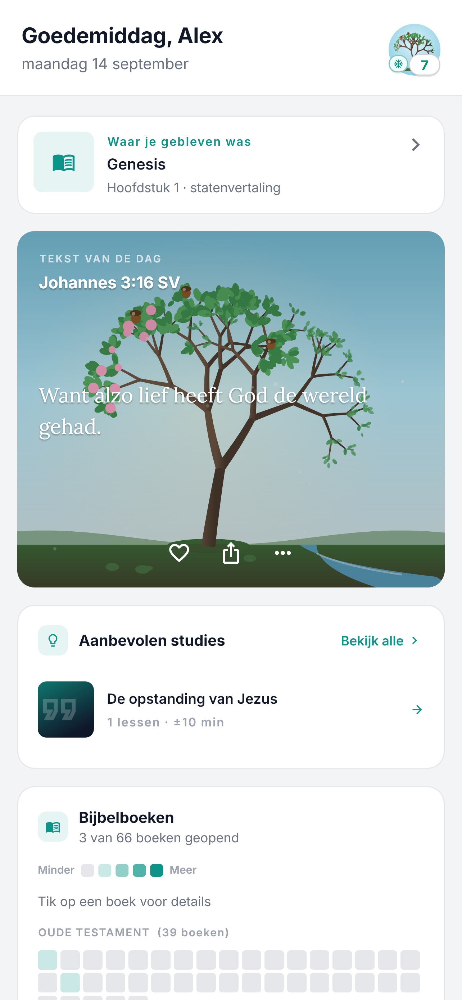
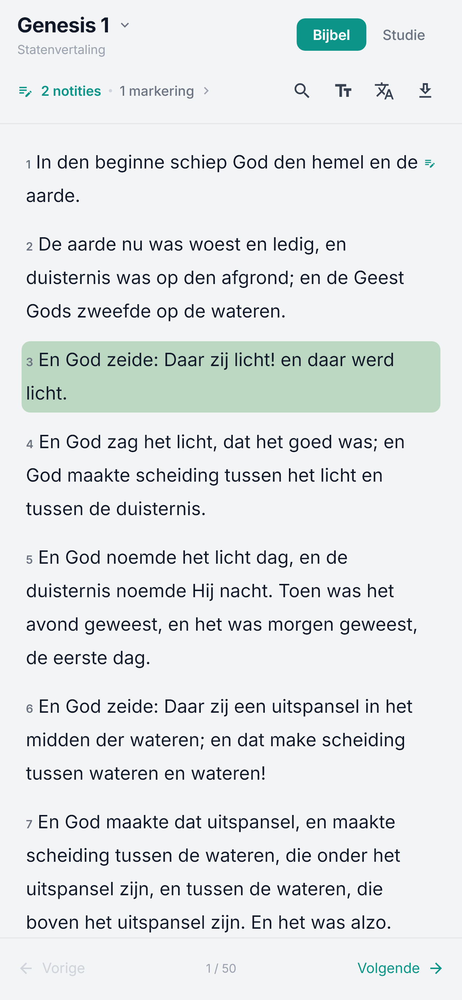
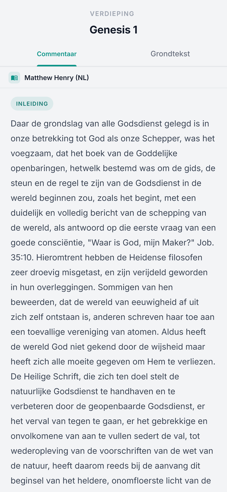
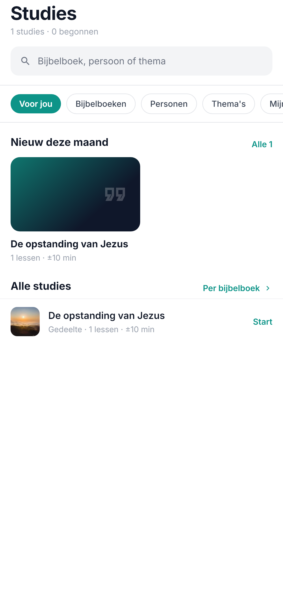
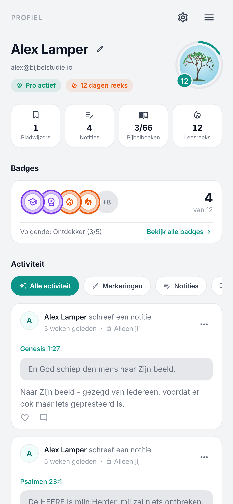
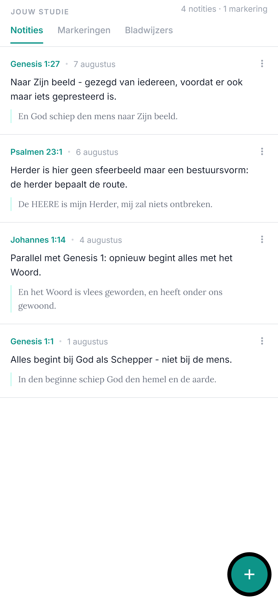
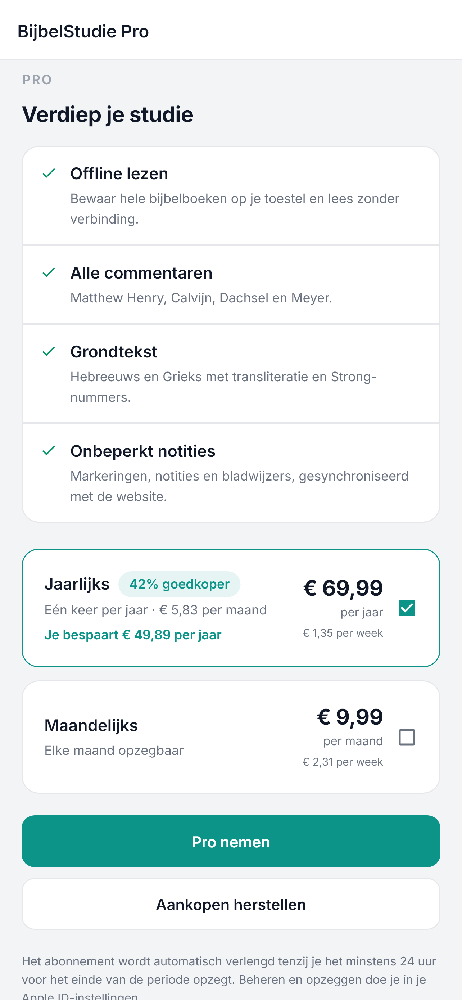

# BijbelStudie - de app

  
  
  
  

  
  
  
  
  

## Over de app

*BijbelStudie* is de iPhone- en iPad-app van [bijbelstudie.io](https://www.bijbelstudie.io), een Nederlands bijbelstudie-platform. Het lost een simpel probleem op: de Bijbel lezen is makkelijk, hem *begrijpen* niet. Wie op de bank een moeilijk hoofdstuk opslaat, heeft meestal geen uitleg bij de hand en geen idee waar te beginnen.

De app zet die hulp naast de tekst, op het apparaat dat je toch al bij je hebt. Je leest een hoofdstuk, ziet er klassiek commentaar bij, kunt de grondtekst erbij pakken en stelt je vraag als je vastloopt. Begeleide studies nemen je in korte lessen door een bijbelboek of thema heen, en je voortgang groeit mee met alles wat je leest, leert en opschrijft.

Voor beginners én voor wie de Bijbel al jaren leest.

## Wat kun je ermee

- **Lezen met uitleg ernaast** - Open een hoofdstuk en lees, met commentaar in een tweede paneel dat meescrollt met de tekst. Eerder gelezen hoofdstukken blijven beschikbaar zonder verbinding.
- **Begeleide studies en leesplannen** - Stap voor stap door een bijbelboek of thema, in lessen die je in één zitting afmaakt. Een leesplan houdt bij waar je bent.
- **Grondtekst** - Zie het oorspronkelijke Hebreeuws en Grieks bij het vers dat je leest, ook zonder de taal te kennen.
- **Notities** - Schrijf je gedachten op bij een vers en vind ze later terug, op je telefoon en op de website.
- **Vragen stellen** - Een AI-assistent die antwoordt vanuit de tekst die je open hebt, voor wanneer je vastloopt.
- **Voorlezen** - Laat een hoofdstuk voorlezen terwijl je onderweg bent.
- **Achtergrond bij elk boek** - Wie schreef het, wanneer, waar speelt het zich af: een korte inleiding met kaarten bij ieder bijbelboek.
- **Dagvers met herinnering** - Elke dag een vers om bij stil te staan, met een melding op het moment dat jij kiest.
- **Voortgang** - Je reeks, je niveau en een boom die groeit met elke les, elk hoofdstuk en elke notitie. Van kiem tot eeuwenoude boom, in de omgeving die jij kiest.
- **Groepen** - Studeer samen: deel notities en gesprekken met een kring, gezin of vriendengroep.
- **Hulpbronnen en zoeken** - Een bibliotheek met achtergrondmateriaal en zoeken door de hele Bijbel.

## Web en app samen

De app en de website delen één account. Wat je op je telefoon leest, telt op de website mee en andersom: dezelfde studies, dezelfde notities, dezelfde reeks, dezelfde boom. Inloggen kan met Apple, Google of e-mail.

Je kunt beginnen waar je wilt. Een hoofdstuk in de trein op je telefoon, de les 's avonds op een groot scherm afmaken.

## Gratis en Pro

Lezen, studies volgen, notities maken en je voortgang bijhouden is gratis. **BijbelStudie Pro** voegt onder meer extra commentaren, meer ruimte voor de AI-assistent en extra omgevingen en boomsoorten voor je voortgang toe. Pro sluit je in de app af via je Apple-account en beheer je in de App Store.

## Screenshots

| Start | Lezen | Commentaar | Studies |
|---|---|---|---|
|  |  |  |  |

| Notities | Voortgang | Pro |
|---|---|---|
|  |  |  |

iPad-schermen staan in [`screenshots/13-ipad`](screenshots/13-ipad).

## Download

De app is beschikbaar voor iPhone en iPad:

Liever op een groot scherm? Alles uit de app staat ook op [www.bijbelstudie.io](https://www.bijbelstudie.io).

## Gebouwd met

  
  

De app praat met dezelfde API als de website ([AlexLamper/BijbelStudie](https://github.com/AlexLamper/BijbelStudie)). Ontwikkelaarsdocumentatie staat in [`CLAUDE.md`](CLAUDE.md) en de map [`docs/`](docs).

## Contact

Voor vragen of feedback:

- Open een [issue op GitHub](https://github.com/AlexLamper/bijbelstudie-app/issues)
- E-mail: [info@bijbelstudie.io](mailto:info@bijbelstudie.io)
- GitHub: [@AlexLamper](https://github.com/AlexLamper)

---

Bedankt voor het verkennen van *BijbelStudie* - we hopen dat het je bijbelstudie-ervaring verrijkt.
